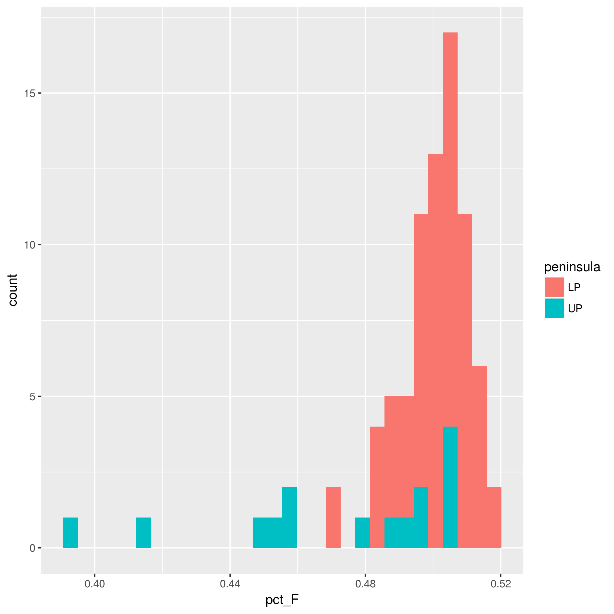
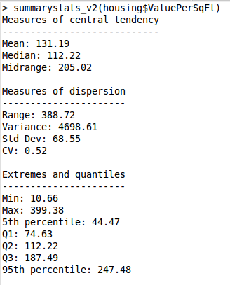
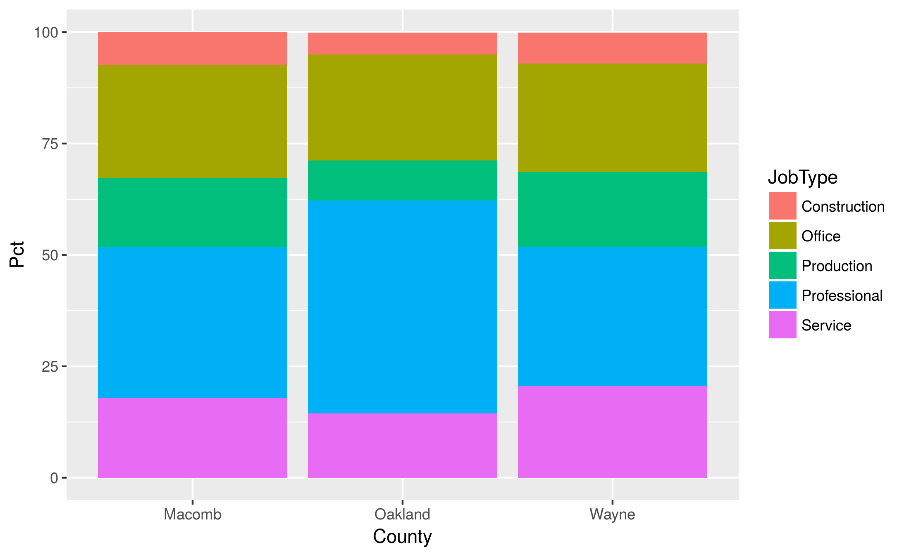

```{r setup, include=FALSE}
knitr::opts_chunk$set(echo = TRUE)
```

## Step 1 - Familiarize yourself with the data and the assignment

In this assignment you'll do some exploratory data analysis
with R on a dataset US census information based on the [American Community Survey](https://www.census.gov/programs-surveys/acs/). The version of
this data that we'll be using is from a Kaggle dataset. See
https://www.kaggle.com/muonneutrino/us-census-demographic-data/data and look
at the column metadata for the county level table to see what the various
columns mean.

As we did in class, you'll be creating an R Markdown document to
both prepare a dataset and do some analysis as well as to document the
steps you did (and answer some questions I'll throw at you).

You'll notice a few "Hacker Extra" tasks
thrown in. These are for those of you who want to go a little above and beyond
and attempt some more challenging tasks. 

## Step 2 - Create a new R Markdown document

Save this file as a new R Markdown document and name it **HW3_EDA2wR_[_your last
name_].Rmd**. Mine would be called **HW3_EDA2wR_isken.Rmd**. Save it into the
same folder as this file.

This will be your working directory. 

## Step 3 - Set working directory and explore data folder

Create an R Studio project in the current folder. You'll notice that there is a folder named **data**.
Inside of it you'll find the data files for this assignment:

- **acs2015_census_tract_data.csv**
- **acs2015_county_data.csv**
- **us_census_bureau_regions_and_divisions.csv**
- **county_MI.csv**

The first two files are from the Kaggle site for this dataset. The last file,
**county_MI.csv**, is a file that I created and just contains data from
Michigan. The R script, **census_data_prep.R** was used to create the file as
well as to merge information from the
**us_census_bureau_regions_and_divisions.csv** file with the county data.


## Step 4 - Complete the following R tasks and answer questions

Now you'll need to complete the following tasks in R. Just like we did in class,
you should use a combination of markdown text (be concise, no need to write tons
of text) to explain what you are doing and R code chunks to actually do it. When
you are done, use the "Knit" button to generate an HTML file from your R
Markdown. You'll be submitting BOTH the completed R Markdown file as well as the
generated HTML file. You'll notice that I've left some empty code chunks as well
as some partially filled in code chunks. Of course, feel free to add more code
chunks as needed.

Let's load a few libraries we'll need:

```{r}
library(plyr)
library(dplyr)
library(ggplot2)
```


Let's read in the data.

```{r read_countydata}
county_df <- read.csv(file='data/county.csv')
county_MI <- read.csv(file='data/county_MI.csv')
```

The county_MI data frame contains data for Michigan only and includes an
peninsula field. See **census_data_prep.R** to see how this field was
created. It involves scraping a table out of a web page.


### Problem 1 - Basic filtering 

Use county_MI.

Using basic R commands (i.e. **no plyr or dplyr**) list all the rows for counties in the Upper
Peninsula.

```{r up_counties}
#county_MI
```

Now do the same thing but use dplyr. Do NOT use the pipe operator.

```{r filter1}

```

Repeat using dplyr and using the pipe operator.

```{r filter2}
#county_MI 
```

List rows for counties with population greater than or equal to 200000. Use dplyr.

```{r filter3}

```

Counties with population greater than or equal to 200000 and sorted in
descending order by population. Use dplyr.

```{r filter4}

```

Counties with median income between 30000 and 40000. Sort in ascending order
by median income.

```{r filter5}

```

### Problem 2 - Selecting columns

Use county_MI.

Population by county sorted descending by population. Just show county and
population.

```{r}
# county_MI %>%
#   ???
#   arrange(???)
```

Counties with population < 50000 and just the columns County, peninsula
and TotalPop. Sort ascending by population.

```{r select1}

```

Counties with population < 50000 and just the the first 5 columns (except for
column 3) along with Income and Poverty. Sort descending by Poverty.

```{r select2}

```

Counties with population > 100000 and just the the first 2 columns, TotalPop, and any column starting with "Inc". Sort descending by Income.

```{r select3}

```

### Problem 3 - Create new columns with mutate

Use county_MI.

Create a new column called pct_F which is the percentage of females in that
county. First do it by NOT saving the computed column. Just compute it
and display the columns County, TotalPop, pct_F. Sort descending by pct_F.

```{r mutate1}
# county_MI %>%
#   mutate(pct_F = ???) %>%
#   arrange(???) %>%
#   ???
```

Now compute pct_F and save the pct_F column (along with the existing columns) in
a new data frame called county_MI_x.

```{r mutate2}
#county_MI_x <- ???
```

Show that it worked by using select to show County, TotalPop, pct_F in
the new data frame.

```{r mutate3}
# county_MI_x %>%
#   ???
```

County with highest percentage of women? Lowest percentage of women? Create dplyr
statements that make it easy to answer these questions.

```{r mutate4a}

```

Now create the following histogram using the ideas from the previous queries.

```{r}

```

Confirm that the columns Professional, Service, Office, Construction,  and 
Production sum up to 100 (within +- .105). There are a number of ways to do
this. You could use `mutate` and/or use base R commands.

```{r}
# tot_job_type <- ???
# 
# summary(tot_job_type)
# err_tol <- 0.105
# ???
```


### Summarization

Use county_MI.

Find total population by peninsula using dplyr.

```{r pop_peninsula}
# county_MI %>%
#   ??? %>%
#   ???
```

Number of counties by peninsula.

```{r numcounties_peninsula}
# One way to do it is with the "shortcut" function count().
# county_MI %>%
#   ??? %>%
#   count()
```

Repeat the two previous queries using plyr instead of dplyr.

```{r pop_peninsula_plyr}
# ddply(???)
```

```{r numcounties_peninsula_plyr}
# ddply(???)
```


Compute the following statistics for median Income by peninsula.

Let's be perfectly clear, we are computing statistics based on medians which
is not the same as computing the statistics by the grouping variables. We don't
have the raw data. So, we just need to be clear that these are summary stats
of a median income.

* mean, median, 5% trimmed mean
* range, standard deviation, coefficient of variation, IQR
* 5th, 25th, 50th, 75th and 95th quantiles


```{r summarystats_mi}
# county_MI %>%
#   ??? %>%
#   summarize(???,
#             ???,
#             several more rows))
```


Now look at the entire US. What are the 5th, 50th, and 95th percentile of median income by state? Sort in descending ordery by median of median income.

```{r summarystats_us}

```

Which states have the highest average percentage of production workers? Just return the top
10 states and their Production values.

```{r top10production}

```

Which states have the lowest average percentage of people who drive to work?
Be careful about those NA values...

```{r lowpctdrive1}

```

Which counties having a total population greater than 75000 have the lowest
percentage of people who drive to work? Display State, County and Drive.

```{r lowpctdrive2}

```

Repeat the previous query for the state of Michigan.

```{r lowpctdrive_mi}

```


For this next question you do **not** need plyr or dplyr.

Create a correlation matrix for total population, per capita income and child poverty. 

```{r correlation}
# ???
```

Write a few sentences interpreting the correlation matrix.

**Hacker Extra**: Write a function that writes out the summary statistics like
I did in this example from our Moodle site:

```{r}

```


Compute the proportion of counties in the US with total population greater than 75000.
You can do this very easily without dplyr. Hint: mean(). No need for plyr or dplyr.

```{r pctgt75k}
# mean(???)
```

Use dplyr and ggplot along with the pipe operator to create a histogram of SelfEmployed
for all counties in the US with total population > 75000.

```{r histo1}
# county_df %>%
#   ??? %>%
#   ggplot(???) + ???
```


Create a bar chart showing total population by region. Use dplyr as needed to create
a data frame to plot. Hint: You'll also want to learn about the `stat` layer in ggplot.


```{r create_df_toplot}
# pop_by_region <- county_df %>%
#   ??? %>%
#   ???)
```

```{r barchart}
# ggplot(data=pop_by_region) + ???
```


Now redo the previous plot but make it a horizontal bar plot and order the bars
from longest to shortest.

```{r}

```


** Hacker Extra**

How do the three counties in the Metro Detroit area (Macomb, Oakland, Wayne) compare in terms
of the breakdown of what kinds of jobs people have. Create a stacked bar chart. Mine
looks like this:

```{r}

```

Hint: The tidyr package is helpful.

```{r}
# jobtype <- several lines to create dataframe to drive the plot 
```

```{r}
# ggplot(jobtype) + 
#   geom_bar(???)

# Here's how to save a plot to a file
ggsave('images/stacked_bars_test.png')
```


### Hacker Extra - Do some more analysis

Try a few things on your own to learn more about the counties in Michigan.
